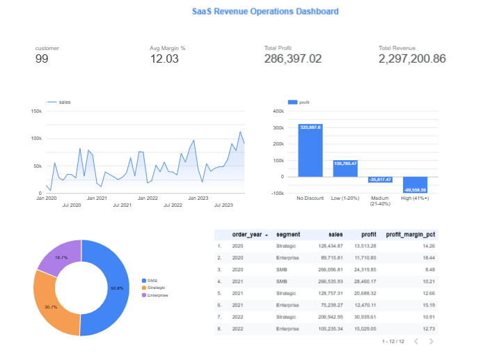

# Revenue Operations Analytics

**SaaS deal desk analytics using BigQuery, SQL, and Looker Studio**

## Project Overview
Analysis of 9,994 SaaS transactions (2020-2023) across 99 customers, 14 products, and 48 countries to uncover revenue optimization opportunities.

## Key Finding
Discounts above 20% destroy profitability across all segments:
- No Discount: +320,988 EUR profit (29.5% margin)
- High Discount (41%+): -99,559 EUR loss (-77.4% margin)
- Recommendation: Cap discounts at 20% to protect 135K+ EUR in annual profit

## Technologies
- **BigQuery** - Cloud data warehouse
- **SQL** - CTEs, window functions, aggregations
- **Looker Studio** - Interactive dashboard
- **Python** - Data extraction (kagglehub)

## Project Structure
    sql/
        01_explore_schema.sql        # Data exploration and profiling
        02_data_cleaning.sql         # Cleaning view with derived metrics
        03_revenue_analysis.sql      # MRR, discount impact, YoY growth, CLV
    looker_studio/
        dashboard_config.md          # Dashboard documentation and link

## Dashboard


[View Looker Studio Dashboard](PASTE_YOUR_LINK_HERE)

## Analysis Highlights
- Monthly Revenue Trend: Consistent growth from 1K EUR (Jan 2020) to 110K+ EUR (Dec 2023)
- Discount Impact: 1,393 deals with over 20% discount destroyed 135K EUR in profit
- Segment Growth: Enterprise surged 51.5% YoY in 2023
- Discount Abuse Detection: Flagged high-discount contacts for deal desk review

## Skills Demonstrated
SQL (CTEs, Window Functions, CASE), BigQuery, Looker Studio, Revenue Operations, Deal Desk Analytics
```

---

**5. .gitignore**
```
*.csv
__pycache__/
.env
.vscode/